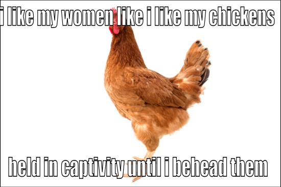

# Meme Analysis Pipeline

A comprehensive pipeline for analyzing memes using Large Language Models (LLMs), Multimodal Language Models (MLMs), and Vision Language Models (VLMs) with ontological knowledge representation.

## 🎯 Overview

To understand memes, we have identified several **dimensions** that capture different aspects of meme content and meaning. These dimensions are formalized in an **ontology** that provides a structured framework for analysis. The pipeline uses a **modular architecture** that:

1. Takes a meme image as input
2. Extracts dimensions using LLMs/MLMs to generate a **knowledge graph** (TTL format)
3. Optionally **refines** the knowledge graph by adding relations between entities
4. Uses the knowledge graph to **generate Q&A pairs** for educational purposes

The architecture is designed to be **modular, refined, and always enriched** - each step builds upon the previous one, with context passing between dimensions to ensure coherent and accurate analysis.

## 🏗️ Architecture

The pipeline consists of two main components:

1. **Knowledge Graph Generation**: Extracts structured dimensions from memes using LLMs and ontological knowledge, producing a TTL knowledge graph
2. **Q&A Generation**: Generates educational question-answer pairs based on the extracted knowledge graph

### Dimension Extraction Order

Dimensions are extracted in a specific order where each step receives context from previous steps, ensuring coherent and accurate analysis:

| Step | Dimension | Receives Context From |
|------|-----------|----------------------|
| 1 | **OverallIntent** | None (extracted first) |
| 2 | **TextualMaterial** | OverallIntent graph |
| 3 | **VisualMaterial** | OverallIntent graph |
| 4 | **Scene** | OverallIntent graph + VisualMaterial entities |
| 5 | **BackgroundKnowledge** | OverallIntent graph + VisualMaterial, TextualMaterial, Scene entities |
| 6 | **EmotionExpression** | OverallIntent graph + VisualMaterial, TextualMaterial, Scene, BackgroundKnowledge entities |
| 7 | **AnalogicalMapping** | OverallIntent graph + VisualMaterial, TextualMaterial, Scene, BackgroundKnowledge, EmotionExpression entities |
| 8 | **SemioticProjection** | OverallIntent graph + VisualMaterial, TextualMaterial, Scene, BackgroundKnowledge, AnalogicalMapping entities |
| 9 | **ToxicityAssessment** | OverallIntent graph + VisualMaterial, TextualMaterial, Scene, BackgroundKnowledge, EmotionExpression, AnalogicalMapping, SemioticProjection entities |
| 10 | **TargetCommunity** | OverallIntent graph + VisualMaterial, TextualMaterial, Scene, BackgroundKnowledge, AnalogicalMapping, ToxicityAssessment entities |

### Context Passing Mechanism

Each dimension extraction step receives:
- **OverallIntent graph**: A TTL-formatted knowledge graph containing the extracted OverallIntent dimension
- **Entity lists**: Lists of previously extracted entities from specific dimensions (e.g., VisualMaterial entities, TextualMaterial entities)

This context is included in the prompt as "In Context Material for the Meme Analysis", allowing the LLM to make more informed and coherent extractions.

## 📖 Running Example: Meme 02158

Let's walk through a complete example using meme `02158` to illustrate the pipeline.

### Input: Meme Image



This meme shows a chicken with text that reads: "I like my women like I like my chickens held in captivity until I behead them."

### Step 1: Knowledge Graph Generation

The pipeline extracts dimensions in the specified order, building a knowledge graph. Here's a snippet from the generated TTL file showing the **ToxicityAssessment** dimension:

```turtle
:toxicity_1 rdf:type :ToxicityAssessment ;
    rdfs:label "Mysogynous"@en ;
    rdfs:comment "The meme uses a crude metaphor comparing women to chickens, implying they are to be controlled and ultimately killed, which is a direct attack on women based on their gender."@en ;
    :extractionMethod "llm_extraction_huggingface" ;
    :extractedFrom "02158.png" ;
    :extractionTimestamp "2025-12-15T10:55:31.356497" .
```

The complete knowledge graph includes all 10 dimensions with their extracted entities and relations. The graph is saved as `02158_refined_ontology.ttl`.

### Step 2: Q&A Generation

Based on the knowledge graph, the pipeline generates educational Q&A pairs for each dimension. Here's the Q&A generated for the **ToxicityAssessment** dimension:

**Question:** The meme's metaphor targets which group?

**Answers:**
1. None of the others
2. Farm animals generally
3. **Women based on gender** ✓ (correct)
4. Political opponents unfairly

**Explanation:** The meme explicitly equates women with chickens and implies control and violence, directly attacking women by gender.

The Q&A is saved in both JSON-LD and human-readable text formats:
- `02158_qa/ToxicityAssessment/02158_ToxicityAssessment_qa_8a4fce55.jsonld`
- `02158_qa/ToxicityAssessment/02158_ToxicityAssessment_qa_8a4fce55.txt`

## 🚀 Quick Start

### 1. Installation

```bash
# Install dependencies
pip install -r requirements.txt

# Copy environment template
cp .env.example .env

# Edit .env with your API keys
# CLAUDE_API_KEY=your_claude_api_key_here
```

### 2. Batch Processing (Recommended)

For processing multiple memes, use the batch scripts:

#### Knowledge Graph Generation

```bash
# Process all images in a directory
./scripts/sh/batch_extract_folder.sh /path/to/images

# The script will:
# - Extract all 10 dimensions in the specified order
# - Generate enhanced ontology TTL files
# - Run refinement to add relations between entities
# - Output refined ontology TTL files
```

The script processes images in the background and generates:
- `{image_name}_enhanced_ontology_reversed.ttl` - Initial knowledge graph
- `{image_name}_refined_ontology.ttl` - Refined knowledge graph with relations

#### Q&A Generation

```bash
# Generate Q&A for all processed memes
./scripts/sh/batch_qa_generation_all.sh

# The script will:
# - Find all refined_ontology.ttl files
# - Generate Q&A pairs for each dimension
# - Save output to organized directories
```

### 3. Single Meme Processing

For processing a single meme:

```bash
# Extract dimensions and generate knowledge graph
./scripts/sh/extract_dimensions_reversed.sh img/meme.png \
  --llm-provider huggingface \
  --refine true \
  --additional-kb prompts/dimension-extraction-prompts-refined/Qua-EntitiesKnowledgeBase.jsonld \
  --additional-kb prompts/dimension-extraction-prompts-refined/AdditionalKnowledgeBase.jsonld \
  --iterative-kb true

# Generate Q&A from the knowledge graph
./scripts/sh/run_qa_generation_reversed.sh \
  --image-path img/meme.png \
  --output-reversed-dir ./output_reversed/hateful-memes-out \
  --output-dir ./output_reversed/hateful_memes_out_final \
  --llm-provider huggingface \
  --use-ttl \
  --ttl-file ./output_reversed/hateful-memes-out/meme_refined_ontology.ttl
```

## 📁 Project Structure

```
.
├── extract_dimensions_reversed.py      # Main extraction script
├── reversed_dimension_extraction_module.py  # Extraction logic
├── qa_generation_module.py             # Q&A generation logic
├── refinement_module.py                # Knowledge graph refinement
├── config.py                           # Configuration settings
├── ontology_loader.py                  # OWL ontology loading
├── llm_integration.py                  # LLM provider interfaces
├── scripts/
│   ├── sh/
│   │   ├── batch_extract_folder.sh    # Batch dimension extraction
│   │   ├── batch_qa_generation_all.sh # Batch Q&A generation
│   │   ├── extract_dimensions_reversed.sh  # Single meme extraction
│   │   └── run_qa_generation_reversed.sh    # Single meme Q&A
│   └── sbatch/                         # SLURM batch scripts
├── prompts/                            # Extraction and refinement prompts
├── memes-features/
│   └── meme-dimensions.ttl            # Base ontology
└── output_reversed/                    # Output directory
```

## 🔧 Configuration

### Environment Variables

Create a `.env` file with the following variables:

```bash
# Claude API Configuration
CLAUDE_API_KEY=your_claude_api_key_here

# HuggingFace Configuration (optional)
HUGGINGFACE_TOKEN=your_hf_token_here
HUGGINGFACE_MODEL=Qwen/Qwen3-VL-8B-Instruct

# Pipeline Configuration
OUTPUT_DIR=./output_reversed
LOG_LEVEL=INFO
```

### Available Dimension Classes

The pipeline extracts the following dimensions from memes:

- `OverallIntent` - Primary purpose or intention
- `TextualMaterial` - Written or textual content
- `VisualMaterial` - Visual content elements
- `Scene` - Spatial arrangements and organization
- `BackgroundKnowledge` - Contextual information and references
- `EmotionExpression` - Emotional content and expressions
- `AnalogicalMapping` - Symbolic representations and mappings
- `SemioticProjection` - Projection of the User onto meme elements
- `ToxicityAssessment` - Harmful or offensive elements
- `TargetCommunity` - Intended audience

## 🔄 Knowledge Graph Refinement

The pipeline includes a **refinement step** that adds relations between individuals in the generated knowledge graph. This step uses materializer prompts to identify and create missing relationships.

### Refinement Materializers

The refinement process includes four materializers that add relations:

1. **AnalogicalMappingRelationsMaterialiser**
   - Adds relations between AnalogicalMapping individuals and VisualMaterial/TextualMaterial entities
   - Uses relations: `:hasMappedEntity`, `:hasMappingEntity`, `:mappedOnto`

2. **EmotionRelationsMaterialised**
   - Adds relations between EmotionExpression individuals and their expressors
   - Uses relations: `:hasExpressor`, and direct relations between entities

3. **SceneRelationsMaterialiser**
   - Adds relations between Scene individuals and their participants
   - Uses relations: `:hasParticipant`, and direct relations between participants

4. **ToxicityRelationsMaterialiser**
   - Adds relations between ToxicityAssessment individuals and toxic elements
   - Uses relations: `:hasToxicElement`

### What Gets Passed to Refinement Prompts

Each materializer receives:
- **Target dimension individuals**: The individuals from the target dimension (e.g., AnalogicalMapping, EmotionExpression, Scene, ToxicityAssessment) with all their properties
- **OverallIntent individuals**: Always included for all materializers to provide context
- **Related dimension individuals**: Specific to each materializer (e.g., VisualMaterial, TextualMaterial, Scene, BackgroundKnowledge)
- **The original image**: For vision-language models

### Using Refinement

To enable refinement, add the `--refine true` flag:

```bash
# Extract dimensions and refine the knowledge graph
./scripts/sh/extract_dimensions_reversed.sh img/meme.png --refine true
```

This will:
1. Extract all dimensions in the specified order
2. Generate `{image_name}_enhanced_ontology_reversed.ttl`
3. Run all four materializers to add relations
4. Generate `{image_name}_refined_ontology.ttl` with the new relations
5. Save LLM output JSON files for each materializer

## 📝 Q&A Generation

The Q&A generation component creates question-answer pairs based on extracted meme dimensions. This process works directly with TTL ontology files and generates educational Q&A pairs for each dimension.

### Q&A Generation Process

The Q&A generation follows these steps:

#### 1. **Input Processing**
- **Input**: TTL ontology file (`{image_name}_refined_ontology.ttl`) containing extracted dimensions and individuals
- **Image**: The original meme image file
- **Dimensions**: All dimensions from the ontology (or filtered subset)

#### 2. **Dimension Processing**
For each dimension in the ontology:

1. **Load TTL File**: The system loads the TTL ontology file using RDFLib
2. **Extract Individuals**: For each dimension, the system:
   - Searches for all individuals of that dimension class in the TTL file
   - Extracts instance names, labels, and descriptions (rdfs:comment) for each individual
   - Groups individuals by their dimension class
3. **Get Dimension Description**: The system retrieves the general dimension description from the base ontology (meme-dimensions.ttl)
   - This includes the dimension's label and comment/description
   - Provides context about what the dimension represents

#### 3. **Q&A Generation**
For each dimension, the system generates one Q&A pair by:

1. **Building Context**:
   - **Meme Image**: The original image is passed to the LLM
   - **Dimension Description**: General description of the dimension from the ontology
   - **Specific Individuals** (if any): List of extracted individuals with their labels and descriptions
     - Format: "FOCUS ON THESE SPECIFIC ELEMENTS IN Q&A GENERATION"
     - Each individual includes: instance name, label, and description

2. **Prompt Creation**:
   - If individuals exist: The prompt instructs the LLM to focus on the specific extracted individuals
   - If no individuals exist: The prompt instructs the LLM to generate Q&A based on the general dimension description only
   - The prompt includes requirements for:
     - 4 answer options (correct, plausible, implausible, "none of the others")
     - Similar answer lengths (2-8 words each)
     - Randomized answer order
     - Clear and specific questions

3. **LLM Generation**:
   - The LLM (Claude or HuggingFace) receives:
     - The meme image
     - The dimension description
     - The list of specific individuals (if any)
   - The LLM generates a Q&A pair in JSON format

4. **Response Processing**:
   - The system parses the LLM response
   - Extracts question, answers, explanation, and metadata
   - Shuffles answers to ensure correct answer is not always first
   - Adds generation metadata (timestamp, method, unique ID)

#### 4. **Output Storage**
For each dimension, the system creates:
- **Directory Structure**: `{output_dir}/{image_name}_qa/{dimension_name}/`
- **JSON-LD File**: `{image_name}_{dimension_name}_qa_{qa_id}.jsonld`
  - Contains structured Q&A data with metadata
  - Includes links to source image and dimension
- **Text File**: `{image_name}_{dimension_name}_qa_{qa_id}.txt`
  - Human-readable format with question, answers, and explanation

### Key Features

1. **Direct TTL Processing**: Works directly with TTL files - no intermediate JSON-LD conversion needed
2. **Handles Empty Dimensions**: If a dimension has no individuals, Q&A is still generated using the dimension description
3. **All Dimensions Processed**: Processes all dimensions from the ontology, not just those with individuals
4. **Individual-Focused**: When individuals exist, the Q&A explicitly focuses on those specific elements
5. **Dimension-Aware**: Each Q&A pair is specific to one dimension, ensuring focused questions

### Q&A Format

Each Q&A pair includes:
- **Question**: A clear, specific question about the dimension
- **Answers**: 4 options with similar length:
  - One correct answer (based on dimension instances or description)
  - One plausible but incorrect answer
  - One implausible answer
  - "None of the others"
- **Explanation**: Brief explanation of the correct answer
- **Metadata**: Dimension name, related instances, generation timestamp

### Usage

```bash
# Generate Q&A for all dimensions from TTL file
./scripts/sh/run_qa_generation_reversed.sh \
  --image-path img/meme.png \
  --output-reversed-dir ./output_reversed/hateful-memes-out \
  --output-dir ./output_reversed/hateful_memes_out_final \
  --llm-provider huggingface \
  --use-ttl \
  --ttl-file ./output_reversed/hateful-memes-out/02158_refined_ontology.ttl

# Generate Q&A for specific dimensions only
./scripts/sh/run_qa_generation_reversed.sh \
  --image-path img/meme.png \
  --use-ttl \
  --dimensions OverallIntent,Scene,EmotionExpression

# Batch processing (using batch_qa_generation_all.sh)
./scripts/sh/batch_qa_generation_all.sh
```

## 📊 Output Formats

The pipeline generates multiple output formats:

### 1. Knowledge Graph Files (TTL)
- **Enhanced ontology**: `{image_name}_enhanced_ontology_reversed.ttl` - Contains original ontology + extracted dimension instances
- **Refined ontology**: `{image_name}_refined_ontology.ttl` - Contains enhanced ontology + relations from materializers (only if `--refine true`)

### 2. JSON-LD Files
- **Standalone dimensions**: `{image_name}_dimensions_reversed.jsonld`
- **Individual dimension files**: `dimensions/{dimension_name}/{image_name}_{instance_name}.jsonld`
- **Q&A pairs**: `{image_name}_qa/{dimension_name}/{image_name}_{dimension_name}_qa_{qa_id}.jsonld`

### 3. Text Files
- **Dimensions summary**: `{image_name}_dimensions_reversed.txt`
- **Q&A pairs**: `{image_name}_qa/{dimension_name}/{image_name}_{dimension_name}_qa_{qa_id}.txt`

### 4. Raw JSON Files
- **Raw dimensions data**: `{image_name}_dimensions_reversed_raw.json`
- **Materializer outputs**: `{image_name}_refined_ontology_{materializer_name}_output.json` (only if `--refine true`)

## 🔌 LLM Providers

### Claude (Anthropic)
- **Model**: claude-3-5-sonnet-20241022
- **Features**: Vision support, high-quality responses
- **Requirements**: API key (set `CLAUDE_API_KEY` environment variable)

### HuggingFace (Local/Remote)
- **Default Model**: Qwen/Qwen3-VL-8B-Instruct
- **Features**: Vision-language model, local processing, no API costs
- **Requirements**: GPU recommended (CUDA), HuggingFace token (optional, for faster downloads)
- **Custom Models**: Can specify with `--llm-model` parameter
  - Example: `Qwen/Qwen3-VL-30B-A3B-Instruct`

## 📝 Usage Examples

### Example 1: Batch Processing

```bash
# Extract knowledge graphs for all images in a directory
./scripts/sh/batch_extract_folder.sh /path/to/images

# Generate Q&A for all processed memes
./scripts/sh/batch_qa_generation_all.sh
```

### Example 2: Single Meme with Refinement

```bash
# Extract dimensions and refine knowledge graph with relations
./scripts/sh/extract_dimensions_reversed.sh img/meme.png \
  --llm-provider huggingface \
  --refine true \
  --additional-kb prompts/dimension-extraction-prompts-refined/Qua-EntitiesKnowledgeBase.jsonld \
  --additional-kb prompts/dimension-extraction-prompts-refined/AdditionalKnowledgeBase.jsonld \
  --iterative-kb true

# Generate Q&A from refined knowledge graph
./scripts/sh/run_qa_generation_reversed.sh \
  --image-path img/meme.png \
  --use-ttl \
  --ttl-file ./output_reversed/hateful-memes-out/meme_refined_ontology.ttl \
  --llm-provider huggingface
```

### Example 3: Q&A for Specific Dimensions

```bash
# Generate Q&A for specific dimensions only
./scripts/sh/run_qa_generation_reversed.sh \
  --image-path img/meme.png \
  --use-ttl \
  --dimensions OverallIntent,Scene,ToxicityAssessment
```

### Example 4: Direct Python Usage (Advanced)

If you need programmatic control:

```python
from reversed_dimension_extraction_module import extract_dimensions_from_image_reversed
from qa_generation_module import QAGenerationModule
from pathlib import Path

# Extract dimensions
result = extract_dimensions_from_image_reversed(
    image_path=Path("meme.png"),
    output_dir=Path("./output"),
    llm_provider="huggingface",
    additional_kb_paths=[
        Path("prompts/dimension-extraction-prompts-refined/Qua-EntitiesKnowledgeBase.jsonld")
    ],
    iterative_kb=True
)

# Generate Q&A
qa_module = QAGenerationModule(llm_provider="huggingface")
qa_result = qa_module.generate_qa_for_dimension_from_ttl(
    dimension_name="ToxicityAssessment",
    ttl_file=Path("./output/meme_refined_ontology.ttl"),
    image_path=Path("meme.png"),
    output_dir=Path("./output")
)
```

## 🐛 Troubleshooting

### Common Issues

1. **Claude API Key Not Found**
   ```
   Error: Claude provider is not available
   ```
   - Solution: Set `CLAUDE_API_KEY` in your `.env` file

2. **HuggingFace Model Not Found**
   ```
   Error: Model not found
   ```
   - Solution: Ensure you have internet access or the model is cached locally
   - Check GPU availability if using CUDA

3. **Image Format Not Supported**
   ```
   Error: Unsupported image format
   ```
   - Solution: Use supported formats: `.png`, `.jpg`, `.jpeg`, `.webp`

4. **Ontology Loading Failed**
   ```
   Error: Failed to load ontology
   ```
   - Solution: Check ontology file path and format

### Debug Mode

Enable verbose logging for debugging:

```bash
# For extraction
python extract_dimensions_reversed.py img/meme.png --llm-provider huggingface --verbose

# For Q&A generation
./scripts/sh/run_qa_generation_reversed.sh --image-path img/meme.png --use-ttl --verbose
```

## 📚 API Reference

### Main Classes

- `ReversedDimensionExtractionModule`: Main dimension extraction component
- `QAGenerationModule`: Q&A generation component
- `RefinementModule`: Knowledge graph refinement component
- `OntologyLoader`: OWL ontology loading and parsing
- `LLMManager`: LLM provider management

### Key Functions

- `extract_dimensions_from_image_reversed()`: Extract dimensions and generate knowledge graph
- `generate_qa_for_dimension_from_ttl()`: Generate Q&A pairs from TTL file
- `refine_knowledge_graph()`: Add relations to knowledge graph

## 🤝 Contributing

1. Fork the repository
2. Create a feature branch
3. Make your changes
4. Add tests if applicable
5. Submit a pull request

## 📄 License

This project is licensed under the MIT License - see the LICENSE file for details.

## 🙏 Acknowledgments

- Anthropic for Claude API
- HuggingFace for open-source vision-language models
- RDFLib for ontology processing
- The meme analysis research community
